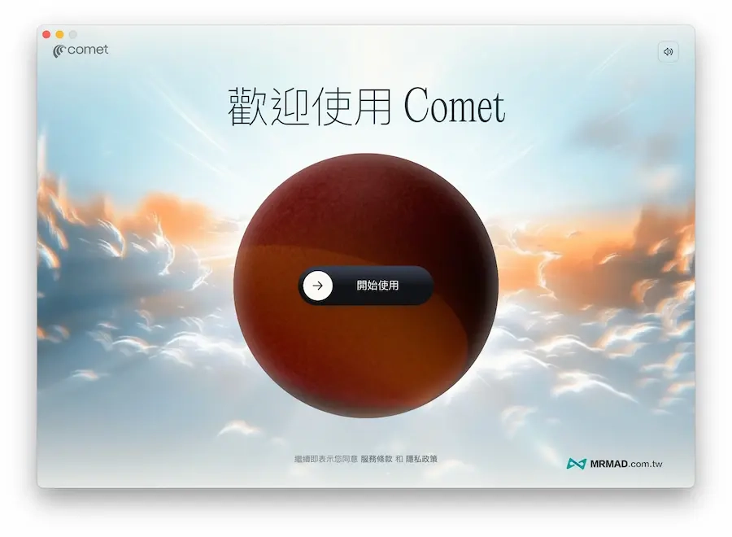
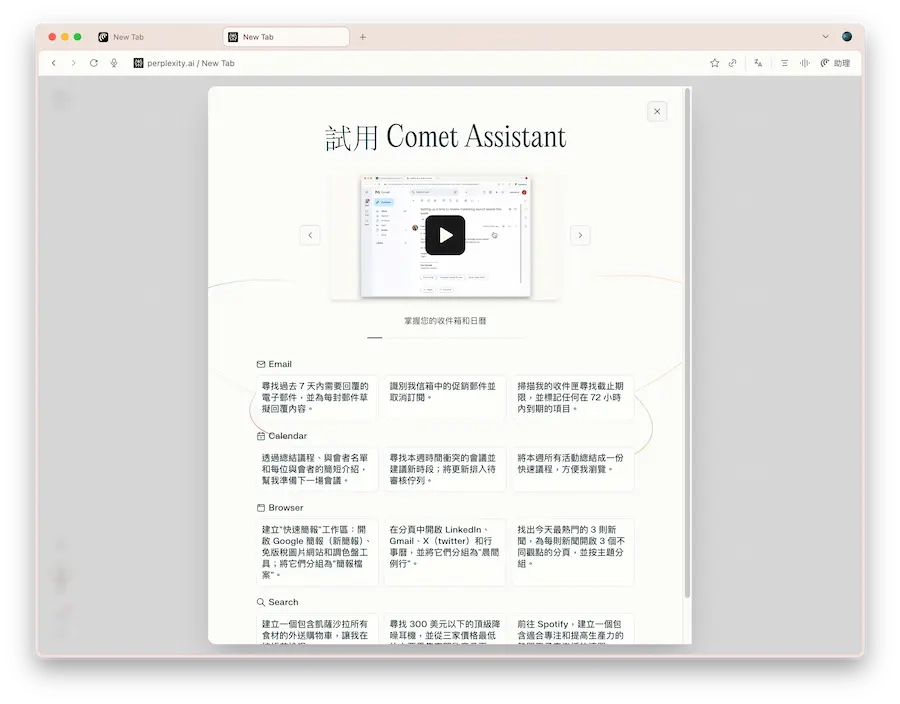

# Perplexity Comet AI瀏覽器全面免費開放：功能差異與使用場景完整解析

---

AI瀏覽器市場正在快速洗牌。Perplexity最近把原本要付200美元才能用的Comet AI瀏覽器直接免費開放了，Windows和macOS都能下載。這對普通用戶來說是个好消息——终于可以不花钱体验AI浏览器到底能干什么。但免費版和付費版差在哪?哪些人真的需要付費?这篇文章會把这些问题讲清楚。

---

## Comet是怎么从"付费专属"变成"全民免费"的

Perplexity的Comet浏览器7月9日刚推出时，只有每月付200美元的Max订阅用户能用。但官方后来透露，排队想试用的人有几百万，于是逐步开放给Pro用户。

测试期间他们发现两件事：第一，用户下载Comet后，提问量直接暴增6到18倍；第二，大家特别爱用內建助理功能——不管是查资料、开会记录、写代码还是网购比价，都离不开它。

现在Perplexity索性把Comet免费化了，官方说法是"希望全世界每个人都有机会选择使用Comet"。背后原因其实不难猜：Google最近表态要做AI浏览器，OpenAI也传出在规划自家产品。AI浏览器这块地盘，已经变成各家科技巨头的新战场。

## 免费版能干什么?主要就是"侧边AI助理"

免费版Comet的核心功能是"侧边AI助理"。简单说，就是在浏览器右边多了一个AI对话窗口，可以帮你解读当前页面、做摘要、回答问题。

另外还能用Perplexity网页版的部分功能，比如个性化新闻推荐、项目管理工具（Spaces）。但要注意，新开分页会自动跳转到Perplexity网页版——体验上就像Chrome加了个AI插件，不算完整的"AI原生浏览器"。

👉 [如果你想深度体验Perplexity的全部功能，这里有现成的Perplexity Pro年费成品号，24小时自动发货，365天质保](https://shaoyumi.com/buy/64)

**Comet下载地址**：[Windows版本](https://www.perplexity.ai/comet) | [macOS版本](https://www.perplexity.ai/comet)

## 付费版多了什么?说白了就是"AI秘书升级套装"

如果你订阅了Perplexity Max（或Pro），Comet会解锁更强的模型和功能。最实用的是"电子邮件助理"——它能根据你的语气写邮件草稿、整理收件箱、安排会议，甚至直接回答邮件里的问题。

最近Perplexity还推出了"背景助理"功能：你可以同时丢给它好几个任务（比如搜机票、抢演唱会门票），它会在后台慢慢处理,完成后通知你。这个体验确实有点像雇了一队AI秘书。

总结一下：付费版在模型能力、研究深度、Labs工具、背景任务处理和团队协作这几方面全面升级。

## 免费版vs付费版：功能差异对比表

为了让大家看得更清楚，我整理了一张详细对比表：

### 1. 模型与算力
- **免费版**：只能用基础模型，侧边助理能力有限
- **Pro/Max/Enterprise**：可以切换OpenAI、Anthropic等高级模型，推理能力更强

### 2. 搜索与研究配额
- **免费版**：基础搜索，配额很少
- **Pro版**：每天300+次Pro搜索，支持长文分析和多步推理
- **Enterprise版**：配额高到基本不用担心用完,适合团队重度使用

### 3. Perplexity Labs/项目工作流
- **免费版**：功能受限，配额少
- **Pro版**：可以用Labs创建报告、表格、小应用，配额明显提高
- **Max版**：Labs和高级模型"实质上不受限"，适合重度研究和创作

### 4. 协作与文件
- **免费版**：文件上传、Spaces协作都有限制
- **Pro版**：更多文件上传量，多人协作，搜索时可选模型
- **Enterprise版**：组织级文件库，适合团队使用

### 5. Comet助理能力
- **免费版**：主要是侧边助理，能摘要和回答问题
- **付费版**：解锁"背景助理"等高级功能，可以处理复杂多步任务

### 6. Comet Plus内容服务
- **免费版**：最近也对所有人开放了，但可能有功能调整
- **付费版**：通常保留优先权益和额外功能

## 哪些人适合用哪个版本?

说了这么多功能差异，到底该选哪个版本?我的建议是：

**免费版适合**：只需要基本AI辅助和网页摘要功能的日常用户。想体验一下AI浏览器是什么感觉，免费版完全够用。

**Pro版适合**：经常做资料研究、需要整理项目、频繁使用AI搜索的人。比如学生写论文、自由职业者做市场调研，Pro版的配额和模型能力会明显够用很多。

**Max版适合**：重度专业用户——比如研究员、内容创作者、程序员。几乎不受限的模型使用量和Labs功能,加上优先体验新功能的权利,适合把AI当生产力工具的人。

**Enterprise版适合**：团队和企业。高配额、文件库管理、安全性和大规模协作支持，适合整个组织一起用。

👉 [需要长期使用Perplexity完整功能的话，这里有Pro年费成品号方案，比官方订阅划算很多，还有365天质保](https://shaoyumi.com/buy/64)

## Comet手机版App还在路上

Perplexity预告会推出Comet移动版App，但官方强调"开发一个移动浏览器不难，但要设计一个结合AI助理与好奇心加速器的移动应用，需要更多思考"。

换句话说，他们不想只是把桌面版搬到手机上，而是想做专门为手机使用场景设计的AI浏览器。什么时候推出?官方没说，但应该不会太久。

---

## 总结

Perplexity把Comet全面免费开放，对普通用户来说是个体验AI浏览器的好机会。免费版虽然功能有限，但日常使用够了；如果你是重度用户，经常需要深度研究或处理复杂任务，[Perplexity Pro年费成品号](https://shaoyumi.com/buy/64)是个更划算的选择——相比官方订阅，价格更合理，功能一样全面，还有完整的售后保障。AI浏览器的战争才刚开始，但至少现在，普通人也能免费上车了。
